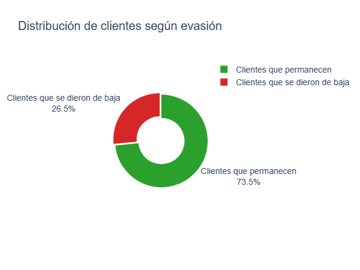
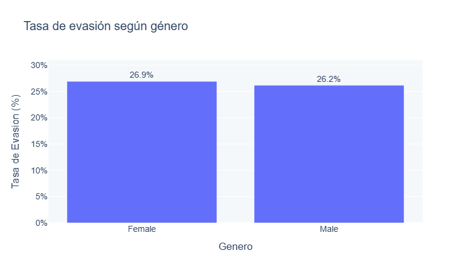
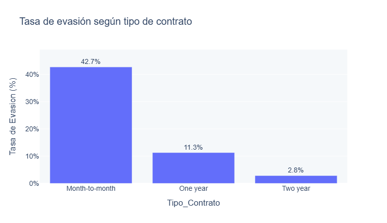
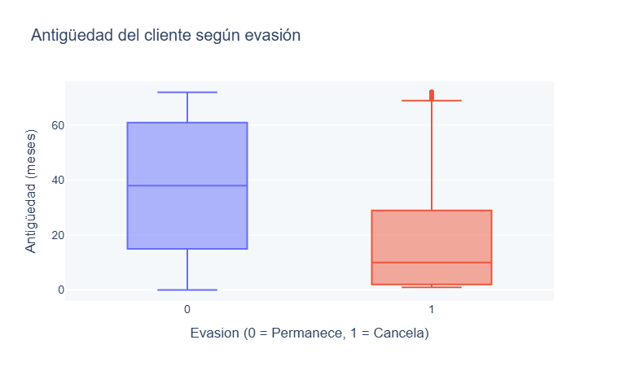
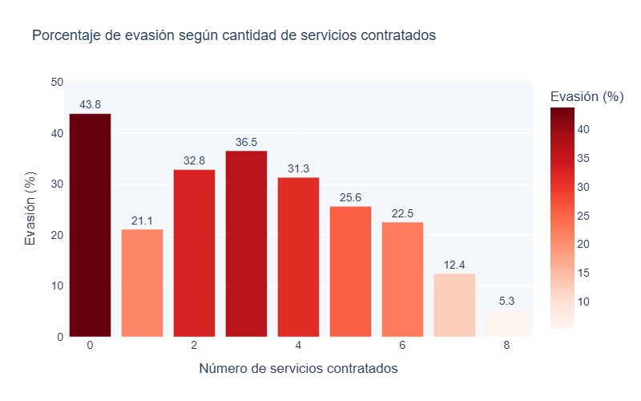

# Análisis de Evasión de Clientes (Churn) – Telecom X

## 📌 Propósito del Proyecto
Este proyecto tiene como objetivo analizar la **evasión de clientes (Churn)** en la empresa ficticia **Telecom X**, identificando patrones y factores que influyen en la decisión de cancelar el servicio.

A través de técnicas de **limpieza de datos, transformación, análisis exploratorio y visualización**, se busca generar **insights accionables** que puedan apoyar la toma de decisiones estratégicas orientadas a la **retención de clientes**.

Este análisis fue desarrollado como parte de la **especialización en Data Science de Alura Latam** y forma parte de mi portafolio profesional.

---

## 🧠 Preguntas que guía el análisis
- ¿Cuál es la proporción de clientes que abandonan el servicio?
- ¿Cómo se distribuye la evasión según variables demográficas y contractuales?
- ¿Qué relación existe entre cargos, antigüedad y evasión?
- ¿La cantidad de servicios contratados influye en la probabilidad de churn?

---
## 🛠 Tecnologías y Dependencias
El proyecto fue desarrollado utilizando **Python 3.12.12** y las siguientes librerías:

- [pandas](https://pandas.pydata.org/) → Manipulación y limpieza de datos
- [numpy](https://numpy.org/) → Cálculos numéricos
- [plotly](https://plotly.com/python/) → Visualizaciones interactivas
- [matplotlib](https://matplotlib.org/) → Visualizaciones básicas (opcional)

Instalación rápida de dependencias:

```bash
pip install pandas numpy plotly matplotlib
```

## 📂 Estructura del Proyecto
```
.
├── TelecomX_LATAM.ipynb        # Notebook con todo el análisis
├── README.md                   # Documentación del proyecto
├── data/
│   └── TelecomX_Data.json      # Datos obtenidos desde la API (JSON)
└── images/
    ├── churn_proporcion.png
    ├── churn_por_genero.png
    ├── churn_por_contrato.png
    ├── cargos_vs_evasion.png
    └── servicios_vs_evasion.png
```
## 🧹 Limpieza y Tratamiento de Datos

Durante esta etapa se realizaron los siguientes pasos:
- Carga de datos desde una API en formato JSON.
- Normalización de estructuras anidadas.
- Identificación y tratamiento de valores nulos e inconsistentes.
- Corrección de categorías como “No internet service” y “No phone service”.
- Transformación de variables categóricas a formato binario.
- Renombrado de columnas para mejorar la comprensión del dataset.

## ➕ Creación de nuevas variables

- Cargos_Diarios: cálculo del gasto diario a partir de la facturación mensual.
- Segmento_Gasto_Diario: categorización del gasto diario en rangos (Muy Bajo, Bajo, Medio, Alto, Muy Alto).
- Cantidad_Servicios: número total de servicios contratados por cliente.
  
## 📊 Análisis Exploratorio y Visualizaciones

### Distribución de la evasión de clientes


🔹 **Insight:**  
La mayoría de los clientes no presenta evasión; sin embargo, existe un porcentaje relevante de cancelaciones que justifica la necesidad de analizar los factores asociados al churn.

---

### Evasión según género


🔹 **Insight:**  
No se observan diferencias significativas en la evasión entre géneros, lo que indica que esta variable no es un factor determinante por sí sola.

---

### Evasión según tipo de contrato


🔹 **Insight:**  
Los clientes con contratos **mes a mes** presentan una tasa de evasión considerablemente mayor que aquellos con contratos anuales o bianuales.

---

### Relación entre cargos diarios y evasión


🔹 **Insight:**  
Los clientes con cargos diarios más altos tienden a mostrar una mayor propensión a cancelar el servicio, lo que sugiere sensibilidad al precio.

---

### Cantidad de servicios contratados y evasión


🔹 **Insight:**  
A medida que aumenta la cantidad de servicios contratados, la probabilidad de evasión disminuye, indicando mayor fidelización del cliente.


📈 Insights Destacados

Los clientes con menor antigüedad presentan mayores tasas de evasión.

Los contratos mes a mes están asociados a mayor churn.

Clientes con menor gasto total acumulado tienden a cancelar con mayor frecuencia.

Existe una relación negativa entre antigüedad y evasión.

A mayor cantidad de servicios contratados, menor probabilidad de churn.

✅ Recomendaciones

Fomentar contratos de mayor duración con incentivos.

Implementar estrategias de cross-selling para aumentar la cantidad de servicios.

Diseñar acciones de retención temprana para clientes nuevos.

Identificar perfiles de alto riesgo para campañas personalizadas.

## ▶️ Cómo ejecutar el proyecto

1. Clonar el repositorio
   ```
   git clone https://github.com/tu_usuario/TelecomX_LATAM.git
   ```
2. Abrir el notebook en Jupyter o Google Colab:
    ```
    jupyter notebook TelecomX_LATAM.ipynb
     ```
3. Ejecutar las celdas paso a paso:
   - Carga y normalización de datos desde la API.
   - Limpieza y transformación de columnas.
   - Creación de variables adicionales como Cargos_Diarios y Segmento_Gasto_Diario.
   - Análisis exploratorio con gráficos de evasión según variables categóricas y numéricas.
   - Conclusiones y recomendaciones estratégicas.
     
## 📊 Resultados Destacados

- Los clientes con menor antigüedad presentan mayor probabilidad de cancelar el servicio.
- Los contratos mes a mes están asociados a mayores tasas de evasión.
- Clientes con menor gasto total acumulado tienden a abandonar el servicio.
- Algunas características del método de pago y tipo de contrato muestran patrones claros de riesgo.
- Estos insights permiten diseñar estrategias de retención temprana, ofertas personalizadas y mejorar la fidelización.

## ⚠ Posibles Problemas o Consideraciones

- Algunos registros iniciales contenían valores nulos o inconsistentes que fueron corregidos.
- Las variables categóricas fueron transformadas a valores binarios para facilitar el análisis.
- Las visualizaciones interactúan mejor en entornos como Google Colab o Jupyter Notebook, pero pueden exportarse a HTML para compartir.

## 👨‍💻 Sobre mí
¡Hola! Soy Yeni Andrea Ramírez, apasionada por los datos y entusiasta del análisis, SQL e ingeniería de datos. Este proyecto fue desarrollado como parte de la especialización en Data Science de Alura Latam, y me permitió aplicar de manera práctica los conocimientos adquiridos en el curso, incluyendo limpieza de datos, análisis exploratorio y visualización de información. Forma parte de mi portafolio para mostrar mis habilidades en soluciones basadas en datos reales.

📫 Conecta conmigo:

[](https://www.linkedin.com/in/yeni-andrea-ramirez-tellez-crm/)

